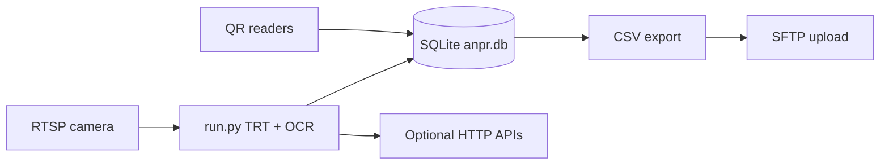

# PFS ANPR (Automatic Number Plate Recognition)

Edge ANPR stack for **PFS / BPCL**–style deployments: real-time plate detection with **TensorRT-accelerated YOLO**, Indian plate **OCR**, optional **QR reader integration**, **SQLite** session mapping, and **scheduled CSV export** with **SFTP** upload. A separate **`anprservices`** package talks to a cloud **ANPR fleet / device dashboard** for configuration and heartbeat.

---

## What this project does

| Area | Description |
|------|-------------|
| **Inference** | RTSP camera → crop ROI → TensorRT YOLO plate detection → OCR on crops → validation and correction for Indian formats |
| **Dual loading lines** | Two boom/line ROIs (Boom-1 / Boom-2) with overlap-based classification and short deduplication windows |
| **QR ↔ vehicle** | SQLite-backed sessions linking ANPR reads and QR scans; hourly (configurable) export and SFTP |
| **Integration** | Optional HTTP incident logging; logging paths and DB/SFTP settings via `config/integration_config.json` |
| **Fleet edge service** | `anprservices/` pulls device/camera config from a remote API using MAC-based auth (see that folder) |

---

## Repository layout

```
ANPR/
├── run.py                    # Main ANPR loop (TensorRT + OCR + boom logic)
├── send_data.py              # Auxiliary sender (referenced from anpr.sh)
├── qr_anpr_mapping.py        # QR–ANPR DB, sessions, export, SFTP hooks
├── db_to_sftp_service.py     # Scheduled export worker (uses qr_anpr_mapping)
├── image_watcher.py          # File watcher integration
├── string_replacer.py        # Indian plate string correction
├── new_ocr.py                # OCR pipeline (TensorRT OCR engine)
├── config/
│   ├── config.json           # Lane/camera/device (RTSP, crop, gate, API)
│   ├── model_config.json     # TRT engines, cfg paths, thresholds
│   ├── integration_config.json  # DB, plant, QR devices, export, SFTP, logging
│   ├── frame_roi.json        # ROI helpers (also under trt_files/config/)
│   └── mapping_config.json
├── utils/                    # Camera, YOLO plugins wrapper, helpers
├── base_modules/             # Acquisition, inference building blocks
├── plugins/                  # Custom TensorRT YOLO layer; build → libyolo_layer.so
├── ANPR_Models/              # Names, cfg references (full weights often not in repo)
├── trt_files/config/         # Alternate packaged configs
├── loading_tagging/          # QR / load-cell related scripts
├── anprservices/             # Edge “fleet” service (main.py, Docker, requirements)
├── start.sh / stop.sh        # Start/stop run.py, qr_tagging, db_to_sftp_service
├── anpr.sh                   # Example launcher (paths may need local edits)
└── report/                   # Example CSV exports (if generated)
```

---

## Prerequisites

- **Python 3** (3.8+ typical; `anprservices` Dockerfile uses 3.11)
- **NVIDIA GPU** with **CUDA** and **TensorRT** matching your Jetson or PC stack
- **OpenCV** (`cv2`), **NumPy**, **PyCUDA**, **TensorRT Python bindings**
- **FFmpeg/GStreamer** support as required by OpenCV for your RTSP URLs
- Built **`plugins/libyolo_layer.so`** (see [TensorRT YOLO plugins](#tensorrt-yolo-plugins))

`anprservices/requirements.txt` lists only that sub-service’s Python deps (`opencv-python`, `psutil`, `pydantic`, `requests`, `schedule`). The main ANPR pipeline has additional native and ML dependencies (TensorRT, PyCUDA, etc.) that must match your device image.

---

## TensorRT YOLO plugins

Custom layers ship as CUDA sources under `plugins/`. Build the shared library before running inference:

```bash
cd plugins
make
```

This produces `libyolo_layer.so`, which `utils/yolo_with_plugins.py` loads at import time. Attribution: YOLO layer sources are derived from [wang-xinyu/tensorrtx yolov4](https://github.com/wang-xinyu/tensorrtx/tree/master/yolov4) (MIT). See `plugins/README.md`.

---

## Configuration

### 1. Lane and model paths (`config/config.json`, `config/model_config.json`)

Set **RTSP URL**, **crop rectangle**, **gate / lane / camera IDs**, **API** flags, and point **`model_config.json`** at your TensorRT engines and Darknet-style cfg/names paths for plate and OCR models.

### 2. Integration (`config/integration_config.json`)

Controls:

- **SQLite** database file path  
- **Plant** name/code  
- **QR reader** devices (IP/port per line)  
- **Export**: CSV directory, file prefix, interval, “run on start”  
- **SFTP**: host, port, credentials, remote paths  
- **Logging**: base directory and ANPR/QR log file names  
- **Sessions**: idle timeout and optional exit boom labels  

**Security:** this file may contain secrets. Restrict file permissions, rotate credentials regularly, and avoid committing production secrets to version control.

### 3. Deploy path consistency (important)

Several modules currently open JSON and directories using **fixed absolute paths** (for example under a legacy install prefix). Before production use, align these with your install directory or symlinks:

- `run.py` reads `config.json` and `model_config.json` from its embedded paths (update to your repo’s `config/` or a single `INSTALL_ROOT`).
- `new_ocr.py` and other modules may read `model_config.json` from similar fixed paths.

Searching the codebase for `open(` and path literals will show every location that must match your deployment layout.

---

## Running the system

### Environment

- Ensure the working directory for Python is the project root so `./plugins/libyolo_layer.so` resolves correctly (or adjust the loader path in `utils/yolo_with_plugins.py`).

### Start all edge services (recommended)

```bash
chmod +x start.sh stop.sh
./start.sh
```

This starts in the background (with PID files under `pids/`):

1. **`run.py`** — main ANPR  
2. **`qr_tagging .py`** — QR tagging worker (note the space in the filename as in the script)  
3. **`db_to_sftp_service.py`** — periodic DB export and upload  

Logs default under `ANPR_SERVICE_LOG_DIR` or `/home/jbmai/PFS/Logs/services/` (see `start.sh`).

### Stop

```bash
./stop.sh
```

### Manual run (debugging)

```bash
python3 run.py
```

Optional: `anpr.sh` shows a pattern using `send_data.py` in the background then `run.py`; edit paths inside the script for your host.

---

## `anprservices` (fleet / dashboard edge)

Directory: `anprservices/`

- **`main.py`** — device MAC discovery, fetches device/camera master data from a configured cloud base URL, writes JSON under `configs/`, heartbeat updates.  
- **`requirements.txt`** — Python dependencies for that service.  
- **`Dockerfile`** — example container (`EXPOSE 8001`, runs `main.py`).  

Configure URLs and auth in line with your environment (`authToken.py`, `urls.py`, `configs/*.json`).

---

## Data flow (high level)



---

## Troubleshooting

| Symptom | What to check |
|--------|----------------|
| `failed to load ./plugins/libyolo_layer.so` | Run `make` in `plugins/` from the project root; run Python with CWD = project root. |
| Camera disconnects | RTSP URL, network, firewall; logs in configured ANPR log path. |
| Wrong boom assignment | ROI coordinates in `run.py` vs actual crop; adjust `roi1`/`roi2` and `crop_frame`. |
| No SFTP files | `integration_config.json` SFTP block, connectivity, and export interval; `db_to_sftp_service.py` logs. |

---

## License and third-party

- TensorRT YOLO plugin code: see `plugins/README.md` and upstream [tensorrtx](https://github.com/wang-xinyu/tensorrtx) (MIT).

---

## Project name

**PFS-ANPR** — ANPR system for the PFS part of the BPCL / Lalru–style deployment. Update this README’s paths and endpoints to match your site before go-live.
